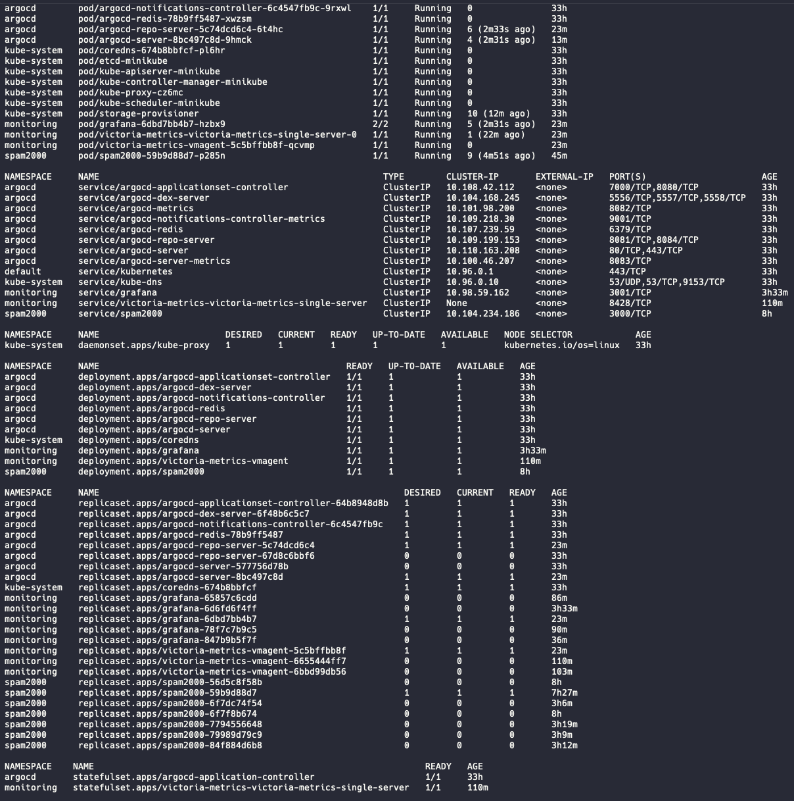
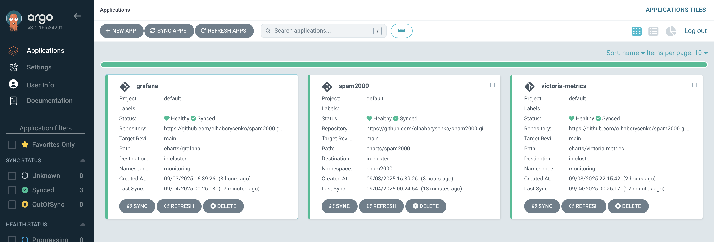
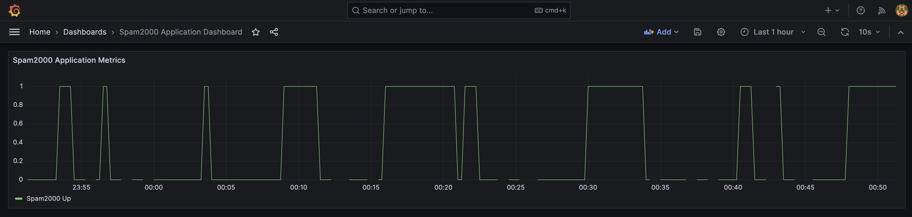

# 🚀 Spam2000 GitOps Platform
<div align="center">


**A modern, cloud-native monitoring platform built with GitOps principles**

*Automated deployment • Real-time monitoring • Production-ready*

</div>

---

## 🎯 Overview

The **Spam2000 GitOps Platform** is a complete Kubernetes monitoring solution that demonstrates modern DevOps practices. It features automatic metric collection, visualization, and GitOps-based deployment using industry-standard tools.

### ✨ Key Features

- 🔄 **GitOps Workflow** - Automated deployments via ArgoCD
- 📊 **Real-time Monitoring** - Custom metrics collection and visualization
- 🛡️ **Security First** - Pod security contexts and network policies
- ⚡ **Optimized Resources** - Right-sized for development and production
- 🎛️ **Custom Dashboards** - Tailored Grafana dashboards for application metrics

---

## 🏗️ Architecture

```mermaid
graph TB
    subgraph "GitHub Repository"
        A[Helm Charts] --> B[ArgoCD Apps]
        C[Manifests] --> B
    end

    subgraph "Kubernetes Cluster"
        B --> D[ArgoCD Controller]
        D --> E[Spam2000 App]
        D --> F[VictoriaMetrics]
        D --> G[Grafana]

        E -->|metrics| F
        F -->|data| G
    end

    subgraph "Monitoring Flow"
        E --> H[/metrics endpoint]
        H --> F
        F --> I[Time Series DB]
        I --> G
        G --> J[📊 Dashboards]
    end
```

### 🧩 Components

| Component | Purpose | Namespace | Port |
|-----------|---------|-----------|------|
| **Spam2000** | Metrics generator application | `spam2000` | 3000 |
| **VictoriaMetrics** | Time-series database | `monitoring` | 8428 |
| **Grafana** | Visualization & dashboards | `monitoring` | 80 |

---

## 🖼️ Screenshots

<div align="center">

### Platform Environment



### ArgoCD UI



### Grafana Dashboard



</div>

---

## 🚀 Quick Start

### Prerequisites

- Kubernetes cluster (1.25+)
- ArgoCD installed
- kubectl configured
- Helm 3.0+

### 1️⃣ Deploy Infrastructure

```bash
# Clone the repository
git clone https://github.com/olhaborysenko/spam2000-gitops.git
cd spam2000-gitops

# Apply namespaces
kubectl apply -f namespaces/

# Deploy via ArgoCD
kubectl apply -f apps/
```

### 2️⃣ Verify Deployment

```bash
# Check ArgoCD applications
kubectl get applications -n argocd

# Verify pods are running
kubectl get pods -n spam2000
kubectl get pods -n monitoring
```

### 3️⃣ Access Services

```bash
# Port forward to Grafana (run manually if needed)
kubectl port-forward -n monitoring svc/grafana 3000:80

# Port forward to VictoriaMetrics (run manually if needed)
kubectl port-forward -n monitoring svc/victoria-metrics-single-server 8428:8428

# Check spam2000 metrics (run manually if needed)
kubectl port-forward -n spam2000 svc/spam2000 3000:3000
curl http://localhost:3000/metrics
```

---

## 🛠️ Automated Deployment

To deploy all resources at once, use the provided Python script:

```bash
python3 deploy_all.py
```

This script applies all manifests and verifies pod status. If you need to access Grafana or VictoriaMetrics UIs, use the port-forward commands above in a separate terminal.

---

## 📊 Monitoring Stack

### VictoriaMetrics Configuration
- **Retention**: 30 days
- **Storage**: 10Gi persistent volume
- **Scrape Interval**: 30 seconds
- **Auto-discovery**: Kubernetes service discovery

### Grafana Features
- **Custom Dashboard**: spam2000 application metrics
- **Data Source**: VictoriaMetrics integration
- **Security**: Non-root user, secure cookies
- **Persistence**: 10Gi for dashboards and config

### Spam2000 Application
- **Metrics Endpoint**: `/metrics`
- **Health Checks**: `/health` and `/ready`
- **Security**: Non-root container, minimal privileges
- **Auto-scaling**: Ready for HPA integration

---

## 🔧 Configuration

### Environment Variables

```yaml
# spam2000 application
METRICS_PORT: 3000
HEALTH_CHECK_INTERVAL: 30s

# VictoriaMetrics
RETENTION_PERIOD: 30d
MAX_SERIES: 1000000

# Grafana
ADMIN_USER: admin
GF_SECURITY_COOKIE_SECURE: true
```

### Resource Allocation

| Service | CPU Request | CPU Limit | Memory Request | Memory Limit |
|---------|-------------|-----------|----------------|--------------|
| spam2000 | 50m | 200m | 64Mi | 256Mi |
| VictoriaMetrics | 100m | 500m | 256Mi | 1Gi |
| Grafana | 100m | 500m | 256Mi | 1Gi |

---

## 🛡️ Security Features

### Network Policies
- **Namespace Isolation**: Cross-namespace communication restricted
- **Port-specific**: Only required ports allowed
- **Zero-trust**: Deny by default, allow explicitly

### Pod Security
- **Non-root Users**: All containers run as UID 1000+
- **Read-only Filesystem**: Where applicable
- **Capability Dropping**: Minimal required capabilities
- **Security Contexts**: Enforced throughout

---

## 🔄 GitOps Workflow

### Automatic Deployment
1. **Push** changes to repository
2. **ArgoCD** detects changes automatically
3. **Sync** applications based on Git state
4. **Monitor** deployment via ArgoCD UI

### Self-Healing
- Automatic drift correction
- Failed deployment rollback
- Resource reconciliation

---

## 📈 Monitoring & Alerting

### Key Metrics
- `spam2000_requests_total` - Total requests
- `spam2000_request_duration_seconds` - Request latency
- `spam2000_errors_total` - Error count
- `vm_rows` - VictoriaMetrics data points
- `vm_alive_targets` - Active scrape targets

### Dashboard Features
- Real-time metrics visualization
- Historical data analysis
- Alert status indicators
- Service health overview

---

## 🛠️ Development

### Local Development

```bash
# Run spam2000 locally
docker run -p 3000:3000 andriiuni/spam2000:1.1394.355

# Test metrics endpoint
curl http://localhost:3000/metrics

# Validate Helm charts
helm lint charts/spam2000
helm template charts/spam2000
```

### Customization

```bash
# Modify values
vim charts/spam2000/values.yaml

# Test changes
helm template spam2000 charts/spam2000

# Deploy via GitOps
git add . && git commit -m "Update configuration" && git push
```

---

## 📋 Troubleshooting

### Common Issues

**ArgoCD App Not Syncing**
```bash
argocd app sync spam2000 --force
```

**Metrics Not Appearing**
```bash
# Check VictoriaMetrics targets
kubectl port-forward -n monitoring svc/victoria-metrics-single-server 8428:8428
curl http://localhost:8428/targets
```

**Pod Startup Issues**
```bash
# Check pod logs
kubectl logs -n spam2000 -l app.kubernetes.io/name=spam2000
kubectl describe pod -n spam2000 -l app.kubernetes.io/name=spam2000
```

---

## 🤝 Contributing

1. Fork the repository
2. Create a feature branch (`git checkout -b feature/amazing-feature`)
3. Commit changes (`git commit -m 'Add amazing feature'`)
4. Push to branch (`git push origin feature/amazing-feature`)
5. Open a Pull Request

---

## 📄 License

This project is licensed under the MIT License - see the [LICENSE](LICENSE) file for details.

---

## 🙏 Acknowledgments

- **VictoriaMetrics Team** for the excellent time-series database
- **Grafana Labs** for the powerful visualization platform
- **ArgoCD Community** for GitOps excellence
- **Kubernetes Community** for the orchestration platform

---

<div align="center">

**Built with ❤️ for the Cloud Native Community**

[🐛 Report Bug](https://github.com/olhaborysenko/spam2000-gitops/issues) • [✨ Request Feature](https://github.com/olhaborysenko/spam2000-gitops/issues) • [💬 Discussions](https://github.com/olhaborysenko/spam2000-gitops/discussions)

</div>
